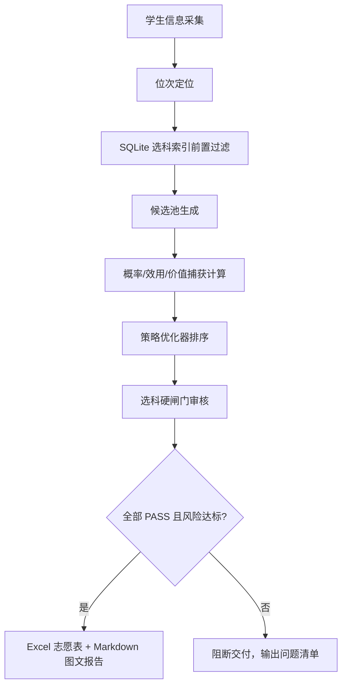

# 山东高考知识库

面向山东新高考志愿填报的本地化知识库与决策引擎。项目以山东省教育招生考试院官方数据为主源，围绕一分一段表、投档表、招生计划、选科要求、政策文件和学生个性化偏好，构建可追溯、可审计、失败关闭的志愿填报工作流。

> 高考志愿属于高风险、不可逆决策。本项目的目标不是“替人拍脑袋选学校”，而是把每一个判断落到数据、证据、概率、风险和复核流程上。

## 维护者

- 维护者邮箱：`768212312@qq.com`
- 数据主源：山东省教育招生考试院及其官方附件
- 适用范围：山东省普通高考志愿填报数据整理、选科审核、风险评估与方案生成

## 核心能力

- **官方数据治理**：`raw/` 保留原始材料，`processed/` 存放脚本生成的标准数据，`wiki/` 维护结构化知识。
- **选科防幻觉索引**：基于 `processed/选科要求/subject_index.sqlite` 进行确定性查询，输出 `PASS/BLOCK/REVIEW + evidence_id + source_file`。
- **志愿硬闸门**：任何正式 96 志愿方案必须先通过 `scripts/audit_volunteer_subjects.py`，存在 `BLOCK` 或 `REVIEW` 即禁止交付。
- **策略优化器**：`algorithms/strategy_optimizer.py` 对候选池执行来源质量、选科证据、概率、效用、梯度配额和滑档风险检查。
- **低分高价值捕获**：通过 `value_capture_score` 识别“低分上好大学/好专业”的真实机会，但不允许越过安全闸门。
- **双件交付标准**：正式方案必须包含 Excel 志愿表和 Markdown 图文说明报告，报告需覆盖风险、证据、价值机会、选科审核和红队结论。

## 项目结构

```text
山东高考知识库/
├── AGENTS.md                  # Codex/Agent 操作宪法
├── CLAUDE.md                  # Claude/Agent 操作宪法
├── README.md                  # 项目说明
├── raw/                       # 官方原始资料，只读、不可变
├── processed/                 # 标准化数据，脚本可重复生成
│   ├── 一分一段表/
│   ├── 投档表/
│   ├── 分数线/
│   ├── 志愿计划/
│   └── 选科要求/
│       ├── subject_index.sqlite
│       └── subject_index_meta.json
├── scripts/                   # 数据处理、审核、测试脚本
├── algorithms/                # 志愿策略与风险优化算法
├── wiki/                      # 结构化知识库
└── students/                  # 学生工作区，本地隐私数据，不提交 GitHub
```

## 数据原则

1. **以山东省教育招生考试院为唯一正式主源**：政策、计划、位次、投档、分数线均以 `sdzk.cn` 及其官方附件为准。
2. **位次优先于分数**：山东等级赋分制下，跨年比较必须使用位次，分数只作沟通辅助。
3. **本科专科分开**：数据池、批次、计划、风险判断必须独立。
4. **选科先查库后回答**：LLM 不得凭上下文或记忆判断选科可报性，必须调用确定性脚本。
5. **失败关闭**：缺字段、来源不可追溯、选科未 PASS、保底不足或滑档超限，均阻断正式交付。

## 快速开始

### 1. 构建选科 SQLite 索引

```bash
python scripts/build_subject_index.py --rebuild
```

输出：

```text
processed/选科要求/subject_index.sqlite
processed/选科要求/subject_index_meta.json
```

### 2. 运行核心测试

```bash
python scripts/test_subject_index.py
python scripts/test_strategy_optimizer.py
```

### 3. 单条选科可报性查询

```bash
python scripts/check_subject_eligibility.py \
  --year 2026 \
  --level 本科 \
  --subjects 物理,化学,生物 \
  --school-code 10001 \
  --major-code 080101 \
  --json
```

返回字段包括：

```text
status, eligible, reason_code, match_type, evidence_id, source_file
```

### 4. 审核 96 志愿方案

```bash
python scripts/audit_volunteer_subjects.py \
  --input students/某考生/志愿方案/96志愿.xlsx \
  --year 2026 \
  --level 本科 \
  --subjects 历史,生物,政治 \
  --out students/某考生/志愿方案/选科审核报告.json
```

退出码：

```text
0 = 全部 PASS
1 = 存在 BLOCK/REVIEW
2 = 脚本运行错误
```

### 5. 运行策略优化器

```bash
python algorithms/strategy_optimizer.py \
  --input students/某考生/候选池.json \
  --out students/某考生/志愿方案/strategy_result.json \
  --slots 96 \
  --risk-profile standard
```

当前算法版本：

```text
strategy_optimizer_v3_value_capture_fail_closed
```

## 使用说明

### 日常查询

适合快速回答“某个专业能不能报”“某个年份位次怎么定位”“某类数据在哪”这类问题。

1. 先查 `wiki/index.md` 定位知识页面。
2. 涉及数值时回到 `processed/` 标准数据，不直接引用记忆。
3. 涉及选科可报性时必须运行 `scripts/check_subject_eligibility.py`。
4. 回答中标注 `source_file`、`evidence_id` 或对应数据文件路径。

### 生成候选池

正式候选池必须按以下顺序生成：

1. 根据考生成绩换算位次，跨年比较只使用位次。
2. 按批次、层次、地域、专业方向和体检/单科限制做初筛。
3. 对每条候选调用 SQLite 选科索引，只保留 `PASS`。
4. 为候选补齐 `probability`、`utility`、`rsi`、`source_quality`、`source_file`、`evidence_id`。
5. 若要识别低分高价值机会，再补充 `school_tier`、`major_value`、`preference_fit`、`location_fit`、`value_opportunity` 等字段。

### 生成正式志愿方案

1. 使用 `algorithms/strategy_optimizer.py` 对候选池排序和风险检查。
2. 生成 96 志愿 Excel 表，保留选科证据、数据来源、概率、效用和价值捕获字段。
3. 使用 `scripts/audit_volunteer_subjects.py` 对 Excel/CSV/JSON 方案做独立选科审核。
4. 生成 Markdown 图文说明报告，包含定位、梯度、风险、低分高价值机会、选科审核、System2 记录和红队结论。
5. 只有 `hard_gate_passed=true` 且选科审核全部 `PASS` 时，才可标记为正式方案。

### 失败处理

出现以下任一情况，必须阻断正式交付：

- 选科审核存在 `BLOCK` 或 `REVIEW`
- 候选不足 96 条
- `保/垫` 数量不足
- `conservative_slip_probability` 超过风险偏好上限
- 来源质量不是 S/A/B
- 缺少 `source_file` 或 `evidence_id`
- 当年招生计划尚未发布，却试图输出正式 2026 方案

失败时只能输出“模拟候选表/问题清单/人工复核清单”，不得口头解释成“应该可以报”。

### GitHub 使用边界

本仓库可以提交知识库、脚本、标准化公开数据和文档；不要提交学生隐私材料。`students/` 已在 `.gitignore` 中默认排除。

推荐提交前运行：

```bash
git status --short
git check-ignore -v students/
python scripts/test_subject_index.py
python scripts/test_strategy_optimizer.py
```

## 正式咨询工作流



## 低分高价值策略

本项目将“低分上好大学/好专业”定义为可审计的价值捕获问题，而不是“捡漏”口号。候选志愿会综合以下字段计算 `value_capture_score`：

| 字段 | 含义 |
|---|---|
| `school_tier` / `school_value` | 院校层次与办学价值 |
| `major_value` | 专业强度、就业/考研/考公价值 |
| `preference_fit` | 与考生目标匹配度 |
| `location_fit` | 城市、距离、区域资源匹配度 |
| `value_opportunity` | 低位次获得高价值的空间 |
| `affordability` | 学费与生活成本适配度 |
| `plan_stability` | 招生计划稳定性 |

注意：`value_capture_score` 只参与排序，不会覆盖选科、来源、风险和保底硬闸门。

## 交付物标准

正式志愿方案至少包含：

```text
students/<姓名>/志愿方案/
├── YYYY-MM-DD_v1.xlsx                 # Excel 志愿表
├── YYYY-MM-DD_v1.md                   # Markdown 图文说明报告
├── YYYY-MM-DD_v1_risk.json            # 风险报告
├── YYYY-MM-DD_v1_subject_audit.json   # 选科审核报告
├── YYYY-MM-DD_v1_meta.json            # 元数据
└── report_assets/                     # 图表与预览图
```

Excel 必须包含 `说明`、`志愿表`、`梯度与风险`、`选科审核`、`证据索引` 等工作表。Markdown 报告必须包含定位图表、梯度图、低分高价值机会图、选科审核图、风险面板、System2 记录和红队结论。

## 隐私与 GitHub 提交

`students/` 存放具体学生信息、成绩、偏好和方案，属于隐私工作区，不应提交到公开仓库。本项目的 `.gitignore` 默认排除：

- `students/`
- `node_modules/`
- `.DS_Store`
- Python/Node 缓存
- 根目录临时生成的志愿表

提交 GitHub 前请再次检查：

```bash
git status --short
git check-ignore -v students/
```

## 常用质量检查

```bash
python scripts/test_subject_index.py
python scripts/test_strategy_optimizer.py
python scripts/audit_data_accuracy.py
```

若涉及 2026 当年计划、缺额、分数线、一分一段或投档结果，必须先核查山东省教育招生考试院最新官方发布，不得用历史数据冒充当年数据。

## 免责声明

本项目用于辅助山东高考志愿填报的数据整理、风险评估和方案审计，不替代山东省教育招生考试院官方信息、招生高校章程、考生本人确认和人工复核。正式填报前必须以当年官方计划、考生实际位次、选科要求、体检限制、单科限制和家庭偏好为准。
